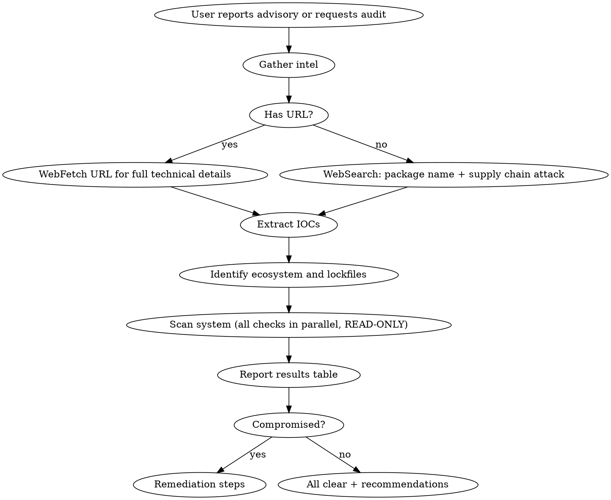

# Supply Chain Check

Scans local projects for compromised packages, malicious dependencies, and indicators of compromise (IOCs) across any package ecosystem.

## CRITICAL SAFETY RULE

**This is a P0 incident response skill. READ-ONLY operations ONLY.**

- **NEVER** install packages (`npm install`, `pip install`, `bun install`, `cargo install`, etc.)
- **NEVER** run package resolution or update commands
- **NEVER** execute suspect code to "verify" a vulnerability
- **NEVER** run postinstall scripts or build steps
- **ONLY** use read-only tools: `rg`, `find`, `ls`, `cat`, `ss`, `grep`, file reads
- If an audit tool is not already installed, **report it as unavailable** — do not install it

## When to Use

- New supply chain attack advisory reported (any ecosystem)
- Routine audit of installed dependencies
- User asks "am I affected by X vulnerability"

## Workflow



## Step 1: Gather Intelligence

**If user provides a URL:** Use `WebFetch` to extract full technical details.

**If no URL provided:** Use `WebSearch` for the advisory. Search for package name + "supply chain attack" or "compromised". Check Snyk, GitHub advisories, Socket.dev, PyPI advisories, RustSec, Go vuln DB. Fetch top result for details.

Extract all of:
- Affected package versions (exact)
- Malicious dependency names introduced
- Filesystem IOCs (file paths per platform)
- Network IOCs (C2 domains, IPs, ports)
- Malicious process names or scripts
- Attack vector (postinstall hook, import-time, build script, etc.)

## Step 2: Identify Ecosystem

Determine which lockfiles and package manifests to scan based on the advisory.

| Ecosystem | Lockfiles | Manifests |
|-----------|-----------|-----------|
| npm/bun/pnpm | `package-lock.json`, `bun.lock`, `bun.lockb`, `pnpm-lock.yaml`, `yarn.lock` | `package.json` |
| Python | `uv.lock`, `poetry.lock`, `Pipfile.lock`, `requirements.txt` | `pyproject.toml`, `setup.py` |
| Go | `go.sum` | `go.mod` |
| Rust | `Cargo.lock` | `Cargo.toml` |
| Ruby | `Gemfile.lock` | `Gemfile` |
| Java/Kotlin | `gradle.lockfile` | `build.gradle`, `pom.xml` |

If unsure how a specific package manager formats its lockfile, look it up before scanning.

## Step 3: Scan System (all in parallel, READ-ONLY only)

### 3a. Discover projects

```bash
find ~ -maxdepth 5 \( -name "LOCKFILE_PATTERN" \) -not -path "*/node_modules/*" -not -path "*/.cache/*" -not -path "*/.local/*"
```

### 3b. Check lockfiles for affected versions

```bash
rg "AFFECTED_VERSION_REGEX" ~ --glob "LOCKFILE_GLOB"
```

### 3c. Check for malicious dependency packages

```bash
rg -l "MALICIOUS_DEP_NAME" ~ --glob "*.json" --glob "*.lock" --glob "*.yaml" --glob "*.toml" --glob "*.txt"
find ~ -maxdepth 6 -type d -name "MALICIOUS_DEP_NAME"
```

### 3d. Check filesystem IOCs

Check all file paths identified in Step 1 — vary per advisory and platform.

### 3e. Check network IOCs

```bash
ss -tnp | grep -E "C2_IP|C2_PORT"
```

### 3f. List installed versions of affected package

```bash
rg -o 'PACKAGE_VERSION_REGEX' ~ --glob "LOCKFILE_GLOB" | sort -u
```

### 3g. Run ecosystem audit tools (ONLY if already installed)

Check if available first with `which`. Do NOT install missing tools.

```bash
# Only run if binary exists on PATH
which npm && npm audit 2>/dev/null
which pip-audit && pip-audit
which govulncheck && govulncheck ./...
which cargo-audit && cargo audit
which bundle-audit && bundle-audit check
```

## Step 4: Report

Always report as a table:

| Check | Result |
|-------|--------|
| Affected versions in lockfiles | Found / Not found |
| Malicious dependencies installed | Found / Not found |
| Filesystem IOCs | Present / Not present |
| Active C2 connections | Detected / None |
| Ecosystem audit tool | Clean / Findings / Not installed |

List all installed versions of the affected package across projects.

## Remediation (if compromised)

1. **Disconnect from network immediately**
2. **Kill malicious processes** — check for RATs, miners, reverse shells
3. **Remove malicious files** — delete IOC artifacts
4. **Pin to safe version** in lockfile, reinstall with clean cache (on a clean machine if possible)
5. **Rotate all secrets** — API keys, tokens, credentials on the machine
6. **Check git history** — ensure no exfiltrated data was committed
7. **Scan other machines** — if same lockfile was deployed elsewhere

## Staying Informed

- **Snyk**: https://snyk.io/blog/
- **GitHub Advisory Database**: https://github.com/advisories
- **Socket.dev**: https://socket.dev/ (npm, PyPI)
- **RustSec**: https://rustsec.org/advisories/
- **Go Vuln DB**: https://vuln.go.dev/
- **PyPI Advisory DB**: https://github.com/pypa/advisory-database
- **OpenSSF Scorecard**: https://scorecard.dev/

## Prevention

- **Pin exact versions** in lockfiles
- **Review install hooks** before installing new packages
- **Use `--ignore-scripts`** (npm) or equivalent for untrusted packages
- **Lockfile-only installs in CI** (`npm ci`, `pnpm install --frozen-lockfile`, `uv sync --frozen`)
- **Automated scanning in CI** — Snyk, Socket.dev, `pip-audit`, `cargo audit`, `govulncheck`
- **Verify package provenance** when available (npm provenance, Sigstore for Python)
